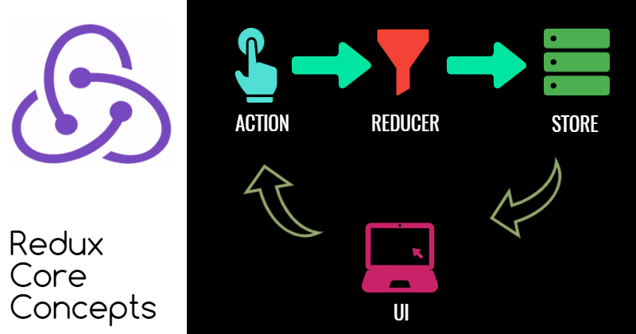
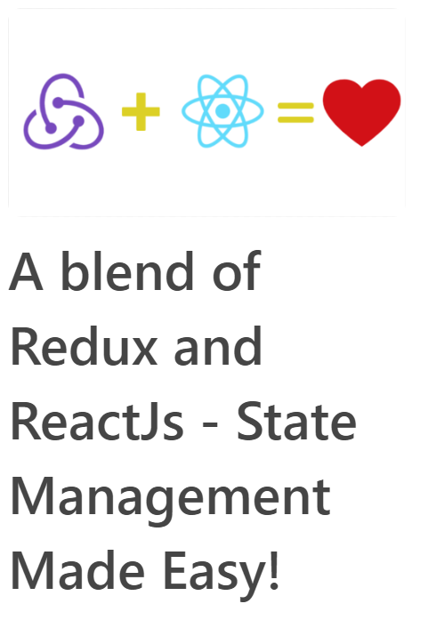

# react-redux-example

Project for explaining react-redux and learn it deeper. It is available to all for exploring.

## Redux Core Concepts

## How about reading the entire series(Work In Progress)?

Liked what I do? Thank You Very Much!

